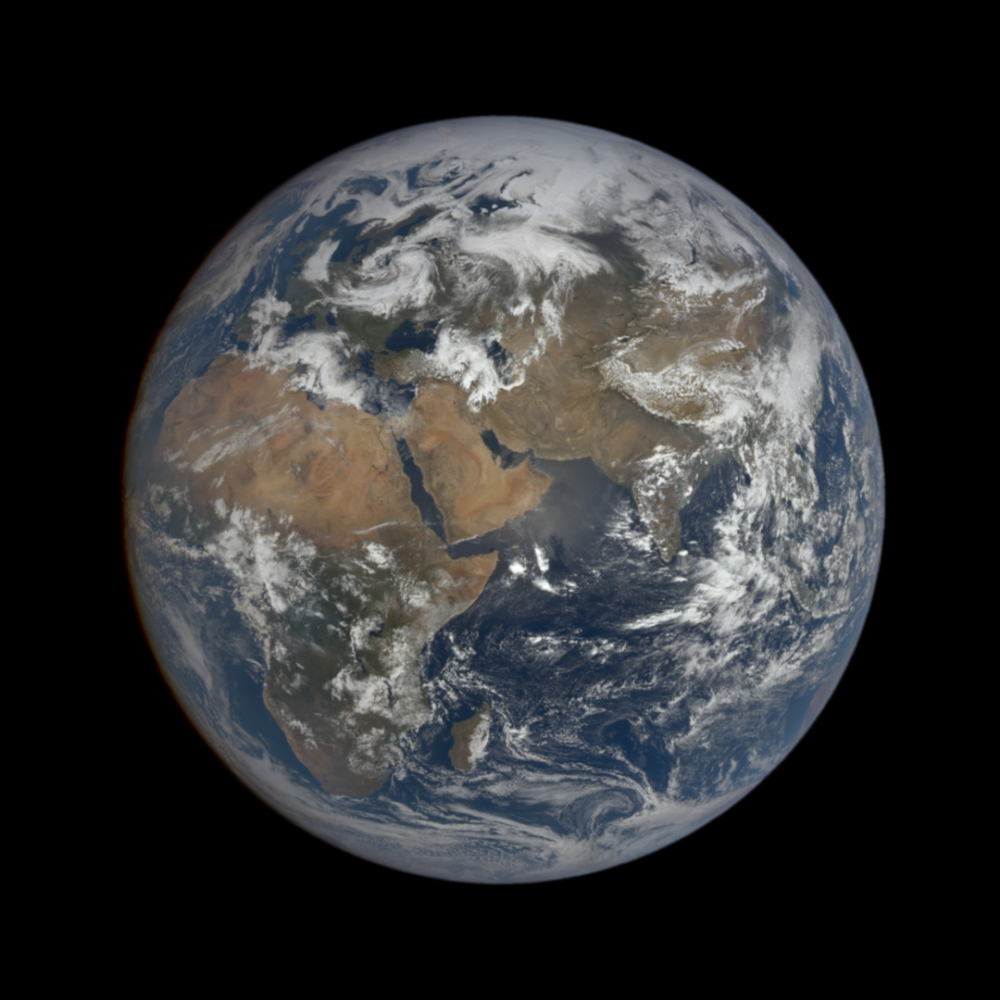
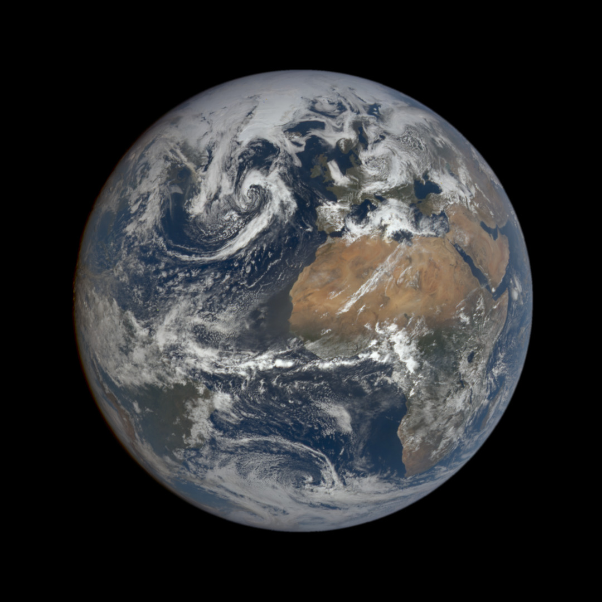
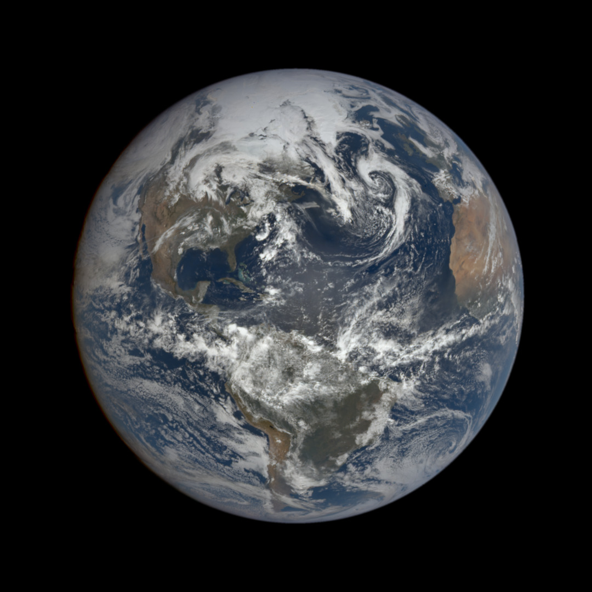
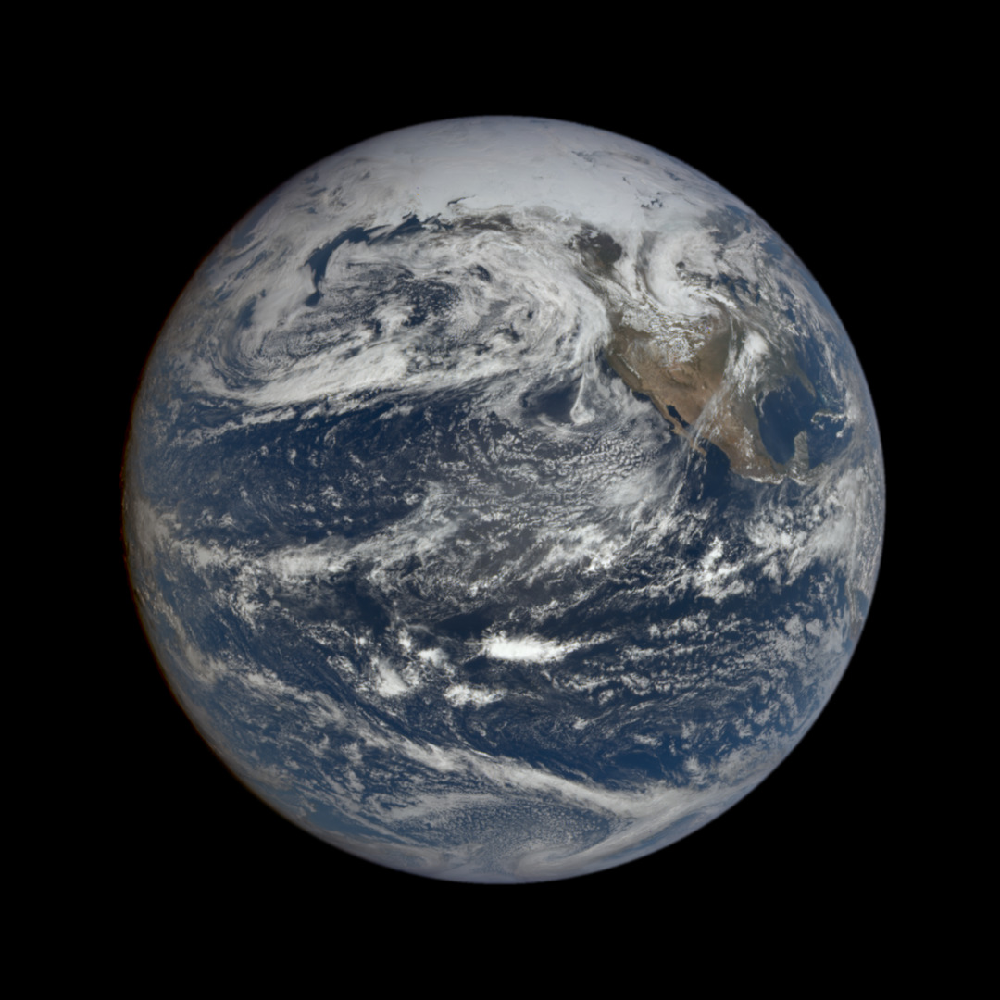

# Daily 🌍 Earth Images

### 🕒 00:03:42 UTC

**Caption:** This image was taken by NASA's EPIC camera onboard the NOAA DSCOVR spacecraft  
**Centroid Coordinates:** (Lat: 19.445801, Lon: 166.025391)

### 🕒 01:09:09 UTC

**Caption:** This image was taken by NASA's EPIC camera onboard the NOAA DSCOVR spacecraft  
**Centroid Coordinates:** (Lat: 19.423828, Lon: 149.633789)

### 🕒 02:14:38 UTC

**Caption:** This image was taken by NASA's EPIC camera onboard the NOAA DSCOVR spacecraft  
**Centroid Coordinates:** (Lat: 19.423828, Lon: 133.26416)

### 🕒 03:20:05 UTC

**Caption:** This image was taken by NASA's EPIC camera onboard the NOAA DSCOVR spacecraft  
**Centroid Coordinates:** (Lat: 19.423828, Lon: 116.894531)

### 🕒 04:25:33 UTC

**Caption:** This image was taken by NASA's EPIC camera onboard the NOAA DSCOVR spacecraft  
**Centroid Coordinates:** (Lat: 19.467773, Lon: 100.50293)

### 🕒 05:31:00 UTC

**Caption:** This image was taken by NASA's EPIC camera onboard the NOAA DSCOVR spacecraft  
**Centroid Coordinates:** (Lat: 19.423828, Lon: 84.155273)

### 🕒 06:36:27 UTC

**Caption:** This image was taken by NASA's EPIC camera onboard the NOAA DSCOVR spacecraft  
**Centroid Coordinates:** (Lat: 19.423828, Lon: 67.763672)

### 🕒 07:41:55 UTC

**Caption:** This image was taken by NASA's EPIC camera onboard the NOAA DSCOVR spacecraft  
**Centroid Coordinates:** (Lat: 19.467773, Lon: 51.416016)

### 🕒 08:47:22 UTC

**Caption:** This image was taken by NASA's EPIC camera onboard the NOAA DSCOVR spacecraft  
**Centroid Coordinates:** (Lat: 19.423828, Lon: 35.024414)

### 🕒 09:52:49 UTC

**Caption:** This image was taken by NASA's EPIC camera onboard the NOAA DSCOVR spacecraft  
**Centroid Coordinates:** (Lat: 19.467773, Lon: 18.676758)

### 🕒 10:58:17 UTC

**Caption:** This image was taken by NASA's EPIC camera onboard the NOAA DSCOVR spacecraft  
**Centroid Coordinates:** (Lat: 19.445801, Lon: 2.307129)

### 🕒 12:03:44 UTC

**Caption:** This image was taken by NASA's EPIC camera onboard the NOAA DSCOVR spacecraft  
**Centroid Coordinates:** (Lat: 19.467773, Lon: -14.0625)

### 🕒 13:09:11 UTC

**Caption:** This image was taken by NASA's EPIC camera onboard the NOAA DSCOVR spacecraft  
**Centroid Coordinates:** (Lat: 19.489746, Lon: -30.366211)

### 🕒 14:14:39 UTC

**Caption:** This image was taken by NASA's EPIC camera onboard the NOAA DSCOVR spacecraft  
**Centroid Coordinates:** (Lat: 19.489746, Lon: -46.757812)

### 🕒 15:20:06 UTC

**Caption:** This image was taken by NASA's EPIC camera onboard the NOAA DSCOVR spacecraft  
**Centroid Coordinates:** (Lat: 19.511719, Lon: -63.149414)

### 🕒 16:25:34 UTC

**Caption:** This image was taken by NASA's EPIC camera onboard the NOAA DSCOVR spacecraft  
**Centroid Coordinates:** (Lat: 19.445801, Lon: -79.49707)

### 🕒 17:31:01 UTC

**Caption:** This image was taken by NASA's EPIC camera onboard the NOAA DSCOVR spacecraft  
**Centroid Coordinates:** (Lat: 19.489746, Lon: -95.844727)

### 🕒 18:36:29 UTC

**Caption:** This image was taken by NASA's EPIC camera onboard the NOAA DSCOVR spacecraft  
**Centroid Coordinates:** (Lat: 19.467773, Lon: -112.280273)

### 🕒 19:41:56 UTC

**Caption:** This image was taken by NASA's EPIC camera onboard the NOAA DSCOVR spacecraft  
**Centroid Coordinates:** (Lat: 19.489746, Lon: -128.605957)

### 🕒 20:47:23 UTC

**Caption:** This image was taken by NASA's EPIC camera onboard the NOAA DSCOVR spacecraft  
**Centroid Coordinates:** (Lat: 19.467773, Lon: -144.931641)

### 🕒 21:52:51 UTC

**Caption:** This image was taken by NASA's EPIC camera onboard the NOAA DSCOVR spacecraft  
**Centroid Coordinates:** (Lat: 19.467773, Lon: -161.323242)

---

*Updated using NASA's EPIC API*  
Imagery © NASA EPIC / DSCOVR  
This repo is powered by a GitHub Actions workflow that automates the entire process.

## 🛰️ What it does

- Runs automatically every day at 9:00 UTC  
- Fetches NASA's Earth images via the EPIC API  
- Updates this README with space imagery and descriptions  
- Commits and pushes these changes automatically  

## 🧠 Why I built this

This project showcases:

- GitHub Actions and CI/CD workflows  
- Automation scripts  
- Git operations from within workflows  
- Working with external APIs  

## ⚙️ How it works

The GitHub Action workflow:

1. Runs on a schedule (daily)  
2. Fetches NASA's EPIC Earth Images of the Day  
3. Updates this README  
4. Commits and pushes the changes  

_Last updated: Fri May 16 14:56:12 UTC 2025_
