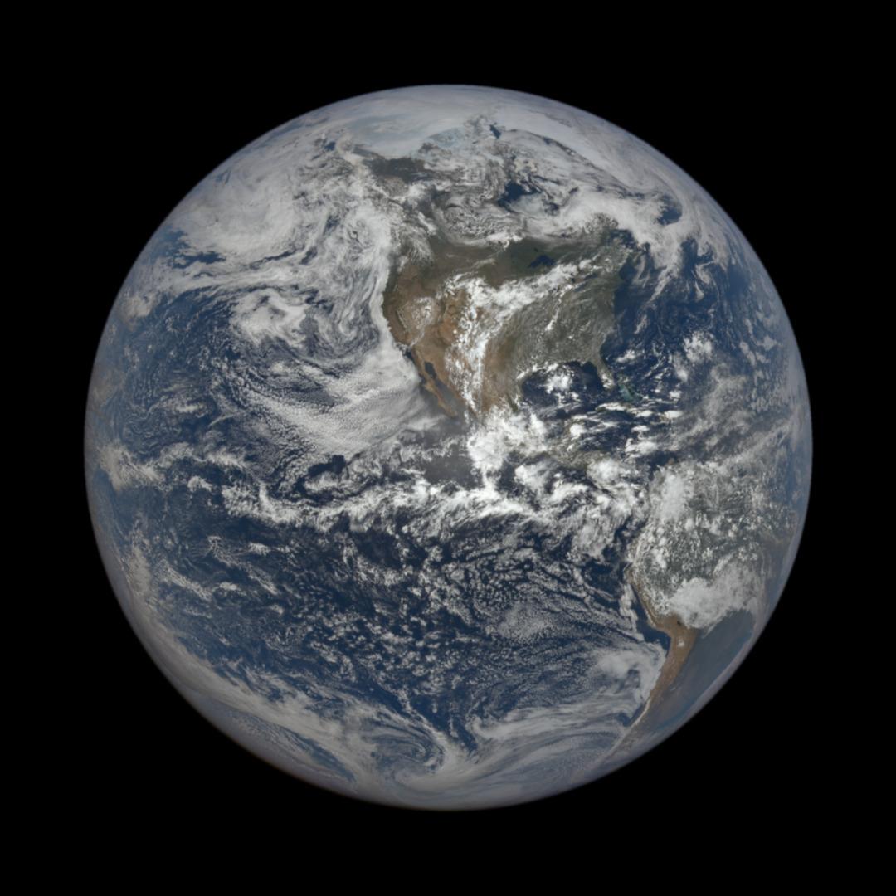

# Daily 🌎 Image

**Coordinates:** 17.753906, -110.500488  
**Caption:** This image was taken by NASA's EPIC camera onboard the NOAA DSCOVR spacecraft

---

## Credits

- Updated using NASA's EPIC API 
- Imagery © NASA EPIC / NOAA DSCOVR spacecraft  
- This repo is powered by a GitHub Actions workflow that automates the entire process.

## What it does

- Runs daily at 13:00 UTC  
- Downloads a random EPIC image of Earth  
- Updates this README with the latest image and its metadata  
- If NASA's EPIC API does not publish a new image, the script will display the most recent available image.

## Why I built this

- GitHub Actions and workflows  
- Automation scripts 
- Python scripts
- Git operations from within workflows  
- Working with external APIs  
- Show a daily random image of Earth

## How it works

- Fetches all available EPIC images  
- Picks one at random  
- Saves the image  
- Updates this README  

## Things to improve

- NASA updates some day's photos more than a day after, so need to account for latency. 

_Last updated: Thu Jun 26 13:34:53 UTC 2025_
